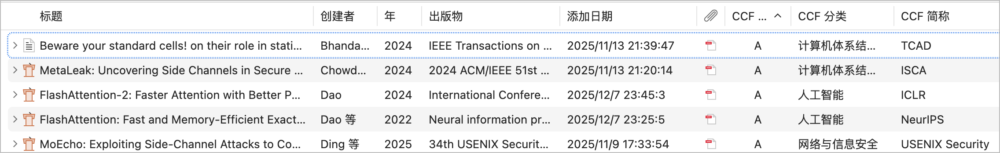
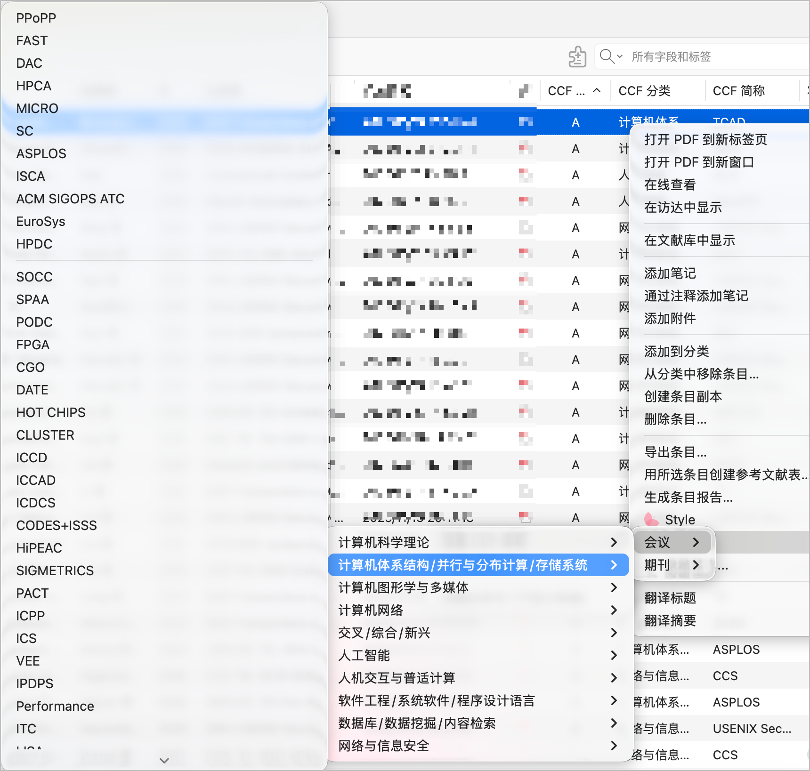

# CCF-Rank

Zotero 插件，用于自动显示文献的 CCF（中国计算机学会）会议和期刊等级，包含完整的 CCF 2026 推荐列表。

### 功能特性

- 自动识别文献的 CCF 等级（A/B/C）、学科分类与官方简称
- 文献列表中一键勾选显示「CCF 等级」「CCF 分类」「CCF 简称」三列
- 自动匹配结果不准确时，可通过右键菜单手动指定 CCF 简称（会议 / 期刊 → 学科分类 → 等级分组），等级与分类自动带出
- 支持「恢复自动匹配」与「忽略条目」

## 安装

1. 从 [Releases](https://github.com/GroundbreakerLhy/CCF-Rank/releases) 页面下载最新的 `.xpi` 文件
2. 打开 Zotero → 工具 → 插件
3. 点击右上角齿轮图标 → Install Plugin From File
4. 选择下载的 `.xpi` 文件

## 使用方法

### 显示 CCF 信息列

1. 在 Zotero 文献列表的表头右键点击
2. 勾选「CCF 等级」「CCF 分类」「CCF 简称」列
3. 插件会自动识别文献所属会议 / 期刊并显示对应信息

### 手动指定简称

自动匹配结果不准确时，右键选中的文献 →「CCF 选项」→「设置 CCF 简称」：

1. 选择类型：会议 / 期刊
2. 选择学科分类
3. 在按 A / B / C 等级分组列表中勾选对应简称，等级与分类自动带出

### 其他操作

- **恢复自动匹配**：清除手动指定的简称，重新自动识别
- **忽略条目**：勾选后该条目不显示任何 CCF 信息

## 数据更新

CCF 推荐列表存储在 `src/data/ccf-conferences.json`，当前数据根据官方 PDF「中国计算机学会推荐国际学术会议和期刊目录第七版（2026年3月更新）」整理。

官方链接：[中国计算机学会推荐国际学术会议和期刊目录](https://www.ccf.org.cn/Academic_Evaluation/By_category/)

便捷查询：[ccf.atom.im](https://ccf.atom.im/)

## 致谢

本项目的开发参考并借鉴了以下优秀的 Zotero 插件，在此表示感谢：

- [Zotero-Scholar-Rank](https://github.com/SiriusXT/Zotero-Scholar-Rank)
- [zotero-ccf-info](https://github.com/TimeTrapzz/zotero-ccf-info)

## 作者

[Groundbreaker](https://github.com/GroundbreakerLhy)
